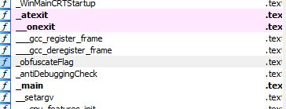

# hide? - 2

## Author
Arasy Dafa Sulistya Kurniawan - omegathrone

## Deskripsi
i thought i was already good at hiding, but you can find me easily in the first challenge. but now im hiding even deeper, try to find me now.

## Message
Diberikan suatu file binary [Binary](challenge/hide)

## Step
Player harus mencari flag yang berada dalam file binary tersebut. Challenge kali ini menggunakan `Code Obsfucation` dengan cara melakukan `XOR` dengan hex `0x20` pada setiap karakter flag. Player harus menggunakan IDA untuk menganalisanya. Pada main function terlihat potongan-potongan dari flag yang ada sebagai berikut.


Karena masih belum ditemukan adanya petunjuk terkait flag, maka kita harus menyusuri fungsi-fungsi lainnya. Terdapat suatu fungsi yang bernama `obsfucateFlag` yang melakukan `XOR` terhadap flag asli. 


Ketika masuk ke dalam fungsi `obsfucateFlag`, dapat dilihat bahwa terdapat operasi `XOR` dengan hex `0x20`.


Lalu buat script python untuk melakukan XOR 20 dari hexa yang terdapat pada fungsi `main` untuk menemukan flagnya.
```python
hex_values = [
    0x4E, 0x11, 0x4D, 0x44, 0x41, 0x63, 0x74, 0x66, 0x5B, 0x10,
    0x42, 0x46, 0x55, 0x15, 0x43, 0x14, 0x17, 0x11, 0x10, 0x4E,
    0x7F, 0x49, 0x73, 0x7F, 0x4D, 0x59, 0x7F, 0x66, 0x14, 0x56,
    0x10, 0x55, 0x11, 0x12, 0x01, 0x54, 0x13, 0x5D, 0x00
]

flag = ''.join(chr(val ^ 0x20) for val in hex_values)
print("Flag:", flag)
```

## Resource
Terdapat file [Hide](source/hide.c) untuk menyembunyikan flag ke dalam binary. Untuk generate binary menggunakan command 
```shell
gcc hide.c -o challenge/hide
```

## Flag
### n1mdaCTF{0bfu5c4710n_iS_my_F4v0u12!t3}  